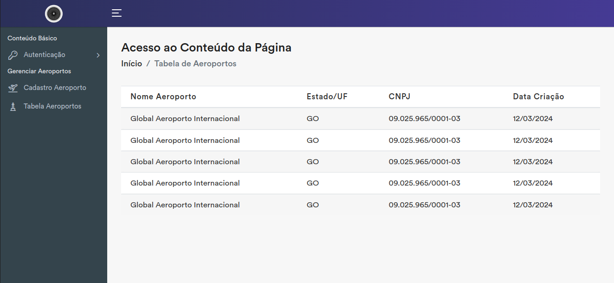

# Protótipo Interativo do Sistema Onix: Uma Jornada Visual pela Experiência do Usuário

## Objetivo

Este protótipo interativo tem como objetivo apresentar as interfaces (telas) do sistema Onix, proporcionando uma simulação visual da experiência do usuário (UI/UX). Ele não possui funcionalidades nem conexão com banco de dados, servindo como uma ferramenta para:

- Visualizar a navegação entre as telas do sistema.
- Compreender o fluxo de ações do usuário.
- Ter uma ideia da interação com os elementos da interface.
- Coletar feedbacks para aprimorar a experiência do usuário.

## Público-alvo

Este protótipo é direcionado a stakeholders do projeto Onix, incluindo:

- Desenvolvedores: para compreender a estrutura das interfaces e como integrá-las ao sistema.
- Designers: para avaliar a estética, usabilidade e interação das interfaces.
- Gerentes de produto: para visualizar o produto final e validar se ele atende às necessidades dos usuários.
- Usuários finais: para ter uma noção de como será a experiência de utilizar o sistema.

## Funcionalidades:

O protótipo permitirá que os usuários:

- Naveguem pelas telas do sistema através de cliques e outros elementos interativos.
- Interajam com os elementos da interface, como botões, menus, campos de texto, etc..
- Observem como as informações são apresentadas e como as ações são executadas.
- Forneçam feedbacks sobre a usabilidade, clareza e estética das interfaces.

## Recursos

- Aeroportos.
  - Cadastro de Aeroporto.
  - Tabela de Aeroporto.
- Serviços do Aeroporto.
  - Cadastro Serviço.
  - Tabela Serviço.
- Operações de Campo.
  - Cadastro Operação.
  - Tabela Operação.

## Benefícios:

A criação deste protótipo interativo trará diversos benefícios, como:

- Melhoria da comunicação entre os stakeholders do projeto.
- Identificação de problemas de usabilidade em um estágio inicial do desenvolvimento.
- Validação das interfaces com base na experiência do usuário.
- Coleta de feedbacks valiosos para aprimorar o produto final.
- Redução de custos e tempo de desenvolvimento ao identificar problemas de forma antecipada.

## Próximos passos:

Após a finalização do protótipo, serão realizados testes de usabilidade com usuários reais para:

- Coletar feedbacks detalhados sobre a experiência do usuário.
- Identificar pontos de melhoria nas interfaces.
- Validar a efetividade do protótipo em alcançar seus objetivos.
- Com base nos resultados dos testes, o protótipo será refinado e aprimorado, visando garantir que ele atenda às necessidades dos usuários e proporcione uma experiência de utilização intuitiva, agradável e eficiente.
